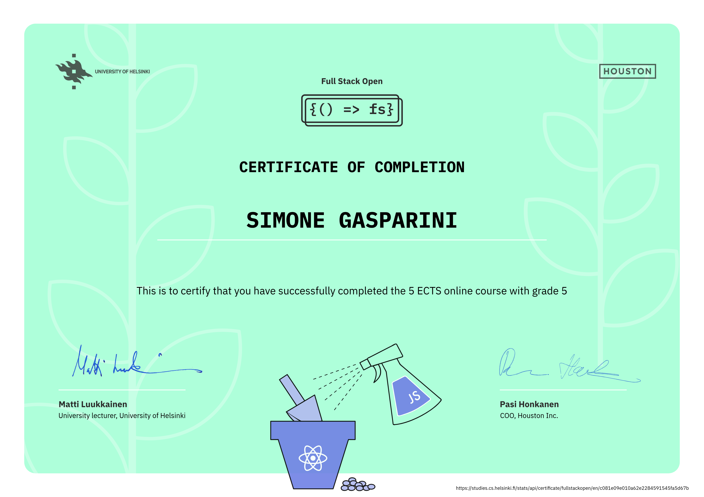

# full-stack-open
My solutions for the University of Helsinki's Full Stack Open course.

## Part 0
Fundamentals of Web apps.

## Part 1
Introduction to React

## Part 2
Communicating with server

## Part 3
Programming a server with NodeJS and Express

## Part 4
Testing Express servers, user administration

## Part 5
Testing React apps, React Router

## Part 6
Advanced state management

## Part 9
TypeScript

## Certificates

### Main course

