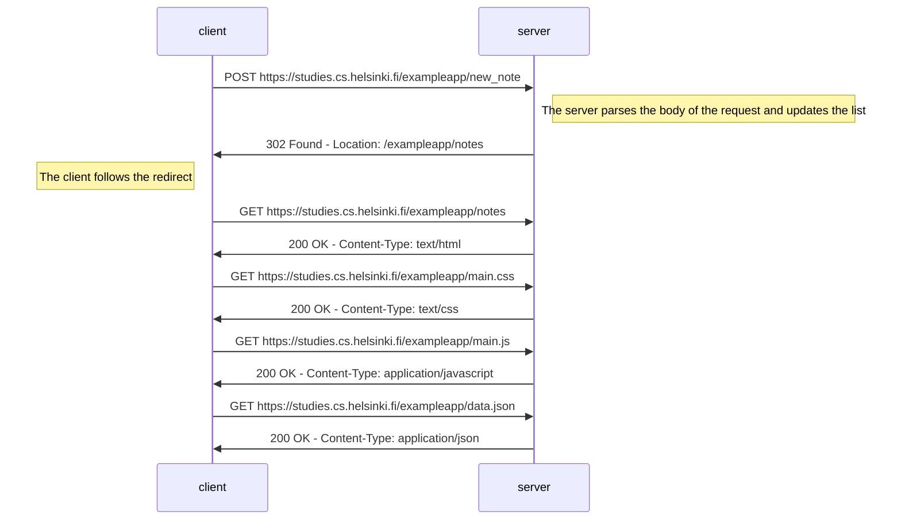

## Sequence diagram representing the Post/Reload/Get Pattern

```mermaid
sequenceDiagram
    participant c as client
    participant s as server

    c->>s: POST https://studies.cs.helsinki.fi/exampleapp/new_note
    Note right of s: The server parses the body of the request and updates the list
    s->>c: 302 Found - Location: /exampleapp/notes
    Note left of c: The client follows the redirect
    c->>s: GET https://studies.cs.helsinki.fi/exampleapp/notes
    s->>c: 200 OK - Content-Type: text/html
    c->>s: GET https://studies.cs.helsinki.fi/exampleapp/main.css
    s->>c: 200 OK - Content-Type: text/css
    c->>s: GET https://studies.cs.helsinki.fi/exampleapp/main.js
    s->>c: 200 OK - Content-Type: application/javascript
    c->>s: GET https://studies.cs.helsinki.fi/exampleapp/data.json
    s->>c: 200 OK - Content-Type: application/json
```
