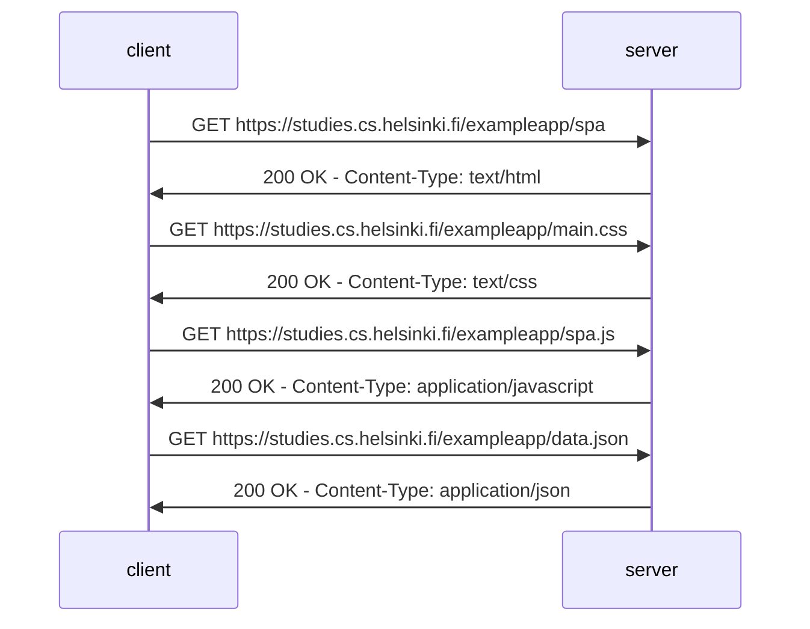

## Sequence diagram of a GET request in a Single Page App

```mermaid
sequenceDiagram
    participant c as client
    participant s as server

    c->>s: GET https://studies.cs.helsinki.fi/exampleapp/spa
    s->>c: 200 OK - Content-Type: text/html
    c->>s: GET https://studies.cs.helsinki.fi/exampleapp/main.css
    s->>c: 200 OK - Content-Type: text/css
    c->>s: GET https://studies.cs.helsinki.fi/exampleapp/spa.js
    s->>c: 200 OK - Content-Type: application/javascript
    c->>s: GET https://studies.cs.helsinki.fi/exampleapp/data.json
    s->>c: 200 OK - Content-Type: application/json
```
