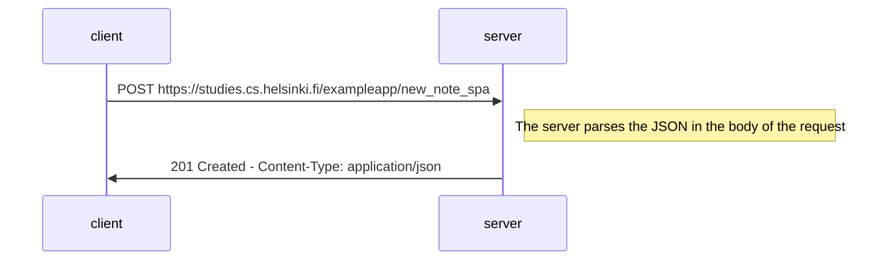

## Sequence diagram of a POST request in a Single Page App

```mermaid
sequenceDiagram
    participant c as client
    participant s as server

    c->>s: POST https://studies.cs.helsinki.fi/exampleapp/new_note_spa
    Note right of s: The server parses the JSON in the body of the request
    s->>c: 201 Created - Content-Type: application/json
```
